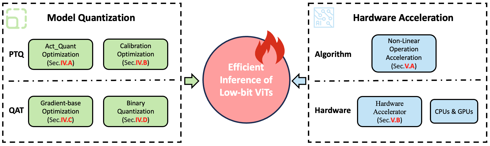

# Awesome Vit Quantization and Acceleration [](https://awesome.re)



🔍 Dive into the cutting-edge with this curated list of papers on **Vision Transformers (ViT) quantization and hardware acceleration**, featured in top-tier AI conferences and journals. This collection is meticulously organized and draws upon insights from our comprehensive survey:

[[Arxiv] Model Quantization and Hardware Acceleration for Vision
Transformers: A Comprehensive Survey](https://arxiv.org/pdf/2405.00314)


## Table of Contents
- [Accuracy Enhancement](#accuracy-enhancement)
    - [Activation Quantization Optimization](#activation-quantization-optimization)
    - [Calibration Optimization For PTQ](#calibration-optimization-for-ptq)
    - [Gradient-base Otimization For QAT](#gradient-base-otimization-for-qat)
    - [Binary Quantization](#binary-quantization)
- [Hardware Acceleration](#hardware-acceleration)
    - [Non-linear Operations Acceleration](#non-linear-operations-acceleration)
    - [Hardware Accelerator](#hardware-accelerator)


## Model Quantization
### Activation Quantization Optimization
| Date | Title | Paper | Code |
| --- | --- | --- | --- |
| 2021.11 | “PTQ4ViT: Post-training Quantization for Vision Transformers with Twin Uniform Quantization” | [[ECCV‘22]](https://arxiv.org/abs/2111.12293) | [[code]](https://github.com/hahnyuan/PTQ4ViT) |
| 2021.11 | “FQ-ViT: Post-Training Quantization for Fully Quantized Vision Transformer” | [[IJCAI’22]](https://arxiv.org/abs/2111.13824) | [[code]](https://github.com/megvii-research/FQ-ViT) |
| 2022.12 | “RepQ-ViT: Scale Reparameterization for Post-Training Quantization of Vision Transformers” | [[ICCV‘23]](https://arxiv.org/abs/2212.08254) | [[code]](https://github.com/zkkli/RepQ-ViT) |
| 2023.03 | “Towards Accurate Post-Training Quantization for Vision Transformer” | [[MM’22]](https://arxiv.org/abs/2303.14341) | - |
| 2023.05 | “TSPTQ-ViT: Two-scaled post-training quantization for vision transformer” | [[ICASSP‘23]](https://arxiv.org/abs/2305.12901) | - |
| 2023.11 | “I&S-ViT: An Inclusive & Stable Method for Pushing the Limit of Post-Training ViTs Quantization” | [[Arxiv]](https://arxiv.org/abs/2311.10126) | [[code]](https://github.com/zysxmu/IaS-ViT) |
| 2024.01 | “MPTQ-ViT: Mixed-Precision Post-Training Quantization for Vision Transformer” | [[Arxiv]](https://arxiv.org/abs/2401.14895) | - |
| 2024.01 | “LRP-QViT: Mixed-Precision Vision Transformer Quantization via Layer-wise Relevance Propagation” | [[Arxiv]](https://arxiv.org/abs/2401.11243) | - |
| 2024.02 | “RepQuant: Towards Accurate Post-Training Quantization of Large Transformer Models via Scale Reparameterization” | [[Arxiv]](https://arxiv.org/abs/2402.05628) | - |
| 2024.04 | “Instance-Aware Group Quantization for Vision Transformers” | [[Arxiv]](https://arxiv.org/abs/2402.05https://arxiv.org/pdf/2404.00928) | - |
| 2024.05 | “P^2-ViT: Power-of-Two Post-Training Quantization and Acceleration for Fully Quantized Vision Transformer” | [[Arxiv]](https://arxiv.org/pdf/2405.19915) | [[code]](https://github.com/shihuihong214/P2-ViT)|
|  |  |  |  |


### Calibration Optimization For PTQ
| Date | Title | Paper | Code |
| --- | --- | --- | --- |
| 2021.06 | “Post-Training Quantization for Vision Transformer” | [[NIPS 2021]](https://arxiv.org/abs/2106.14156) | [[code]](https://gitee.com/mindspore/models/tree/master/research/cv/VT-PTQ) |
| 2021.11 | “PTQ4ViT: Post-training Quantization for Vision Transformers with Twin Uniform Quantization” | [[ECCV’22]](https://arxiv.org/abs/2111.12293) | [[code]](https://github.com/hahnyuan/PTQ4ViT) |
| 2022.03 | “Patch Similarity Aware Data-Free Quantization for Vision Transformers” | [[ECCV‘22]](https://arxiv.org/abs/2203.02250) | [[code]](https://github.com/zkkli/PSAQ-ViT)|
| 2022.09 | “PSAQ-ViT V2: Towards Accurate and General Data-Free Quantization for Vision Transformers” | [[TNNLS’23]](https://arxiv.org/abs/2209.05687) | [[code]](https://github.com/zkkli/PSAQ-ViT)|
| 2022.11 | “NoisyQuant: Noisy Bias-Enhanced Post-Training Activation Quantization for Vision Transformers” | [[CVPR‘23]](https://arxiv.org/abs/2211.16056) | - |
| 2023.03 | “Towards Accurate Post-Training Quantization for Vision Transformer” | [[MM’22]](https://arxiv.org/abs/2303.14341) | - |
| 2023.05 | “Finding Optimal Numerical Format for Sub-8-Bit Post-Training Quantization of Vision Transformers” | [[ICASSP‘23]](https://ieeexplore.ieee.org/abstract/document/10096798?casa_token=zcvT_bqlcWMAAAAA:huDCjkno08m8uyqt8nxwCsOOIlbUepw45TRVb0jsBolA06tUD07FpvcqusUDcFR8ygthcX3syipYx2c) | - |
| 2023.08 | “Jumping through Local Minima: Quantization in the Loss Landscape of Vision Transformers” | [[ICCV’23]](https://arxiv.org/abs/2308.10814) | [[code]](https://github.com/enyac-group/evol-q)|
| 2023.10 | “LLM-FP4: 4-Bit Floating-Point Quantized Transformers” | [[EMNLP‘23]](https://arxiv.org/abs/2310.16836) | [[code]](https://github.com/nbasyl/LLM-FP4)|
| 2024.05 | “P^2-ViT: Power-of-Two Post-Training Quantization and Acceleration for Fully Quantized Vision Transformer” | [[Arxiv]](https://arxiv.org/pdf/2405.19915) | [[code]](https://github.com/shihuihong214/P2-ViT)|
|  |  |  |  |


### Gradient-base Optimization For QAT
| Date | Title | Paper | Code |
| --- | --- | --- | --- |
| 2022.01 | “TerViT: An Efficient Ternary Vision Transformer” | [[Arxiv]](https://arxiv.org/abs/2201.08050) | - |
| 2022.10 | “Q-ViT: Accurate and Fully Quantized Low-bit Vision Transformer” | [[NIPS’22]](https://github.com/YanjingLi0202/Q-ViT) | [[code]](https://github.com/YanjingLi0202/Q-ViT) |
| 2022.12 | “Quantformer: Learning Extremely Low-Precision Vision Transformers” | [[TPAMI‘22]](https://ieeexplore.ieee.org/abstract/document/9992209) | - |
| 2023.02 | “Oscillation-free Quantization for Low-bit Vision Transformers” | [[PMLR’23]](https://arxiv.org/abs/2302.02210) | [[code]](https://github.com/nbasyl/OFQ)|
| 2023.05 | “Boost Vision Transformer with GPU-Friendly Sparsity and Quantization” | [[CVPR‘23]](https://arxiv.org/abs/2305.10727) | - |
| 2023.06 | “Bit-Shrinking: Limiting Instantaneous Sharpness for Improving Post-Training Quantization” | [[CVPR’23]](https://openaccess.thecvf.com/content/CVPR2023/html/Lin_Bit-Shrinking_Limiting_Instantaneous_Sharpness_for_Improving_Post-Training_Quantization_CVPR_2023_paper.html) | - |
| 2023.07 | “Variation-aware Vision Transformer Quantization” | [[Arxiv]](https://arxiv.org/abs/2307.00331) | [[code]](https://github.com/HuangOwen/VVTQ)|
| 2023.12 | “PackQViT: Faster Sub-8-bit Vision Transformers via Full and Packed Quantization on the Mobile” | [[NIPS‘23]](https://proceedings.neurips.cc/paper_files/paper/2023/hash/1c92edb990a05f2269f0cc3afbb4c952-Abstract-Conference.html) | - |
|  |  |  |  |

### Binary Quantization
| Date | Title | Paper | Code |
| --- | --- | --- | --- |
| 2022.11 | “BiViT: Extremely Compressed Binary Vision Transformer” | [[ICCV’23]](https://arxiv.org/abs/2211.07091) | - |
| 2023.05 | “BinaryViT: Towards Efficient and Accurate Binary Vision Transformers” | [[Arxiv]](https://arxiv.org/abs/2305.14730) | - |
| 2023.06 | “BinaryViT: Pushing Binary Vision Transformers Towards Convolutional Models” | [[CVPR‘23]](https://arxiv.org/abs/2306.16678) | [[code]](https://github.com/Phuoc-Hoan-Le/BinaryViT) |
| 2024.05 | “BinaryFormer: A Hierarchical-Adaptive Binary Vision Transformer (ViT) for Efficient Computing” | [[TII]](https://ieeexplore.ieee.org/abstract/document/10531134?casa_token=8Y4nHEENrzYAAAAA:tYGQaHeU7WzXjTT06itL5j79mww5rm2hmCdOWI7nSA4gNwukJaLqMV3oYjmsqMT7Xfk_r5PRruMt_8k) | - |
|  |  |  |  |


## Hardware Acceleration

### Non-linear Operations Acceleration
| Date | Title | Paper | Code |
| --- | --- | --- | --- |
| 2021.11 | “FQ-ViT: Post-Training Quantization for Fully Quantized Vision Transformer” | [[IJCAI’22]](https://arxiv.org/abs/2111.13824) | [[code]](https://github.com/megvii-research/FQ-ViT) |
| 2022.07 | “I-ViT: Integer-only Quantization for Efficient Vision Transformer Inference” | [[ICCV‘23]](https://arxiv.org/abs/2207.01405) | [[code]](https://github.com/zkkli/I-ViT) |
| 2023.06 | “Practical Edge Kernels for Integer-Only Vision Transformers Under Post-training Quantization” | [[MLSYS’23]](https://proceedings.mlsys.org/paper_files/paper/2023/hash/023560744aae353c03f7ae787f2998dd-Abstract-mlsys2023.html) | - |
| 2023.10 | “SOLE: Hardware-Software Co-design of Softmax and LayerNorm for Efficient Transformer Inference” | [[ICCAD‘23]](https://ieeexplore.ieee.org/abstract/document/10323725?casa_token=8bAozNlkGyAAAAAA:fPTP7Za_-ZUqXrPAz8LJkFQjMZi25YHVRL6cV6SvV7z9wBXEna_vSlxcTlOTfVG8oIICJ_qf0YOtjCM) | - |
| 2023.12 | “PackQViT: Faster Sub-8-bit Vision Transformers via Full and Packed Quantization on the Mobile” | [[NIPS’23]](https://proceedings.neurips.cc/paper_files/paper/2023/hash/1c92edb990a05f2269f0cc3afbb4c952-Abstract-Conference.html) | - |
| 2024.05 | “P^2-ViT: Power-of-Two Post-Training Quantization and Acceleration for Fully Quantized Vision Transformer” | [[Arxiv]](https://arxiv.org/pdf/2405.19915) | [[code]](https://github.com/shihuihong214/P2-ViT)|
|  |  |  |  |

### Hardware Accelerator
| Date | Title | Paper | Code |
| --- | --- | --- | --- |
| 2022.01 | “VAQF: Fully Automatic Software-Hardware Co-Design Framework for Low-Bit Vision Transformer” | [[Arxiv]](https://arxiv.org/abs/2201.06618) | - |
| 2022.08 | “Auto-ViT-Acc: An FPGA-Aware Automatic Acceleration Framework for Vision Transformer with Mixed-Scheme Quantization” | [[FPL‘22]](https://arxiv.org/abs/2208.05163) | - |
| 2023.10 | “An Integer-Only and Group-Vector Systolic Accelerator for Efficiently Mapping Vision Transformer on Edge” | [[TCAS-I’23]](https://ieeexplore.ieee.org/abstract/document/10288182?casa_token=oBpwMNaF8IMAAAAA:boTEPmhITligY_dJFfSbwJIR32BTXkRLt6OaKXGlqVJeVpoLcWX-t3zVueL6OOkRqgMjGefO4K1L438) | - |
| 2023.10 | “SOLE: Hardware-Software Co-design of Softmax and LayerNorm for Efficient Transformer Inference” | [[ICCAD‘23]](https://ieeexplore.ieee.org/abstract/document/10323725?casa_token=8bAozNlkGyAAAAAA:fPTP7Za_-ZUqXrPAz8LJkFQjMZi25YHVRL6cV6SvV7z9wBXEna_vSlxcTlOTfVG8oIICJ_qf0YOtjCM) | - |
| 2024.05 | “P^2-ViT: Power-of-Two Post-Training Quantization and Acceleration for Fully Quantized Vision Transformer” | [[Arxiv]](https://arxiv.org/pdf/2405.19915) | [[code]](https://github.com/shihuihong214/P2-ViT)|
|  |  |  |  |

# Citation
If you find our survey useful or relevant to your research, please kindly cite our paper:
```
@misc{du2024model,
      title={Model Quantization and Hardware Acceleration for Vision Transformers: A Comprehensive Survey}, 
      author={Dayou Du and Gu Gong and Xiaowen Chu},
      year={2024},
      eprint={2405.00314},
      archivePrefix={arXiv},
      primaryClass={cs.LG}
}
```